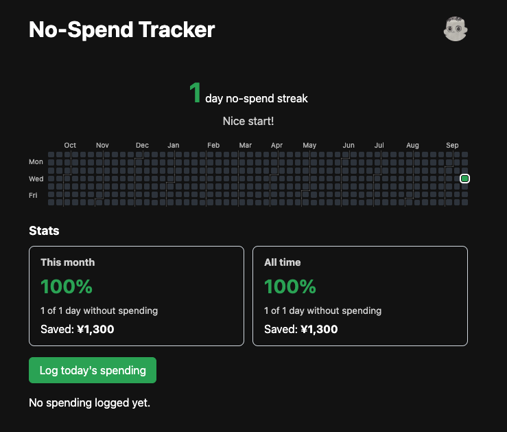
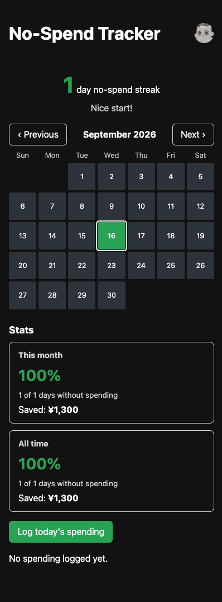
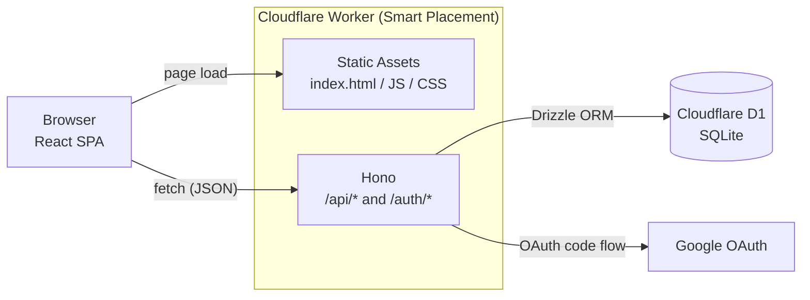

# No-Spend Tracker

A no-spend challenge tracker that celebrates the days you **don't** spend money.
Positive reinforcement instead of guilt, inspired by the No-Spend Challenge culture.

**Live demo:** https://no-spend-tracker.no-spend-tracker.workers.dev (sign in with any Google account)

| Desktop | Mobile |
| --- | --- |
|  |  |

## Why
- Most budgeting apps make you feel bad about spending
- Flip the model: reward no-spend days instead of punishing expenses

## Features
- **Grass for no-spend days**: a GitHub-contribution-style grid of the last 53 weeks grows grass only on days without spending. On narrow screens it switches to a monthly calendar
- **Streak**: counts consecutive no-spend days, including today, with a celebration message
- **Spending log**: add, edit and delete entries (date, note, amount) from a modal; multiple entries per day. Clicking a day on the calendar opens the modal for that date
- **English / Japanese**: switch languages in the app; dates, month and weekday labels, and amounts follow the selected language
- **Settings**: change the timezone and currency (JPY / GBP), sign out, or delete your account
- **Installable (PWA)**: add it to your home screen and launch it like an app
- **Sign in with Google**

## Architecture



A single Worker serves both the SPA and the API, so they share one origin: the session cookie and CSRF protection need no CORS setup.

## Tech Stack
- **Frontend**: React, Vite, react-i18next
- **API**: Hono + TypeScript on Cloudflare Workers
- **Database**: Cloudflare D1 (SQLite) with Drizzle ORM
- **Auth**: Google OAuth (`@hono/oauth-providers`) with self-managed sessions stored in D1
- **Testing**: Vitest

## Design Decisions
**Product**
- Reward-based UX: praise no-spend days instead of tracking spending with guilt
- No-spend is the default. Only expenses are stored, and every day from sign-up to today without an expense counts as a no-spend day, so a good day needs no input at all
- The calendar grows grass only on no-spend days. Spend days get no grass (no reward) and no intensity shading, so large spending is not highlighted
- The streak includes today while no expense has been logged, so progress shows up immediately

**Data**
- Tracking starts on the sign-up date, fixed in the user's timezone at sign-up (changing the timezone later does not move it)
- The timezone (IANA name) is a user setting and decides where each day starts and ends. At sign-up it is taken from the browser (`Intl`), so there is no onboarding screen
- Expenses are stored one per entry, so you can see what the money went on
- Amounts are integers in the currency's minor unit (JPY: yen, GBP: pence) to avoid floating-point errors
- The currency (JPY or GBP) is a user setting, and each expense also stores its own currency, so changing the setting never reinterprets past records. Amounts in different currencies are never added together; a day's total is shown per currency (e.g. "¥500 + £3.50"). The grass and streak only depend on whether a day has any expense, so mixed currencies do not affect them
- The timezone can be changed in settings, but the tracking start date stays fixed

**Security**
- Every query on user data is scoped by the signed-in user's id
- Expense writes (create, update, delete) are rate limited per user with the Workers Rate Limiting binding (30 per minute), protecting the D1 write quota; reads are not limited
- Session tokens are random 256-bit values; only their SHA-256 hash is stored, so a database leak does not expose usable sessions
- Session cookies are `HttpOnly`, `Secure` and `SameSite=Lax`, and state-changing form requests have their `Origin` checked
- The OAuth `state` parameter is verified, and the timezone passed through the login flow is validated before use
- The API returns error codes rather than messages, and the client translates them

## Project Structure
```
src/
  client/   React SPA (screens, calendar, i18n)
  worker/   Hono API (auth, expenses, DB schema)
  shared/   Code used by both (dates, timezone, error codes)
drizzle/    Generated SQL migrations
```

## Development
```sh
npm install
cp .dev.vars.example .dev.vars # fill in the Google OAuth client ID / secret
npm run db:migrate:local       # apply migrations to the local D1
npm run dev                    # http://localhost:8787
```

Other scripts:
```sh
npm test                 # unit tests (Vitest)
npm run typecheck        # type-check the client, Worker and config projects
npm run db:generate      # generate migration SQL after editing src/worker/db/schema.ts
```

The local D1 database is stored per `database_id` in `wrangler.jsonc`. If that id changes, run `npm run db:migrate:local` again.

## Deployment
```sh
npm run db:migrate:remote # only when the schema has changed
npm run deploy            # vite build && wrangler deploy
```

The Google OAuth secrets are stored as Worker secrets:
```sh
npx wrangler secret put GOOGLE_CLIENT_ID
npx wrangler secret put GOOGLE_CLIENT_SECRET
```

## Roadmap
- [x] Rate limiting on expense writes (per user)
- [x] [Privacy policy](PRIVACY.md)
- [x] Account deletion
- [x] Settings screen (language, sign out, account deletion)
- [x] Timezone and currency settings
- [x] PWA support (installable; no offline mode)
- [ ] Currency conversion (JPY / GBP)
- [ ] Monthly challenge mode (e.g. No Spend November)
- [ ] Stats: no-spend rate per month, total saved estimate
- [ ] AI-generated praise messages

## Privacy
See the [Privacy Policy](PRIVACY.md). Questions and deletion requests can be sent via [GitHub Issues](https://github.com/osatoh/no-spend-tracker/issues).

## License
[MIT](LICENSE)
